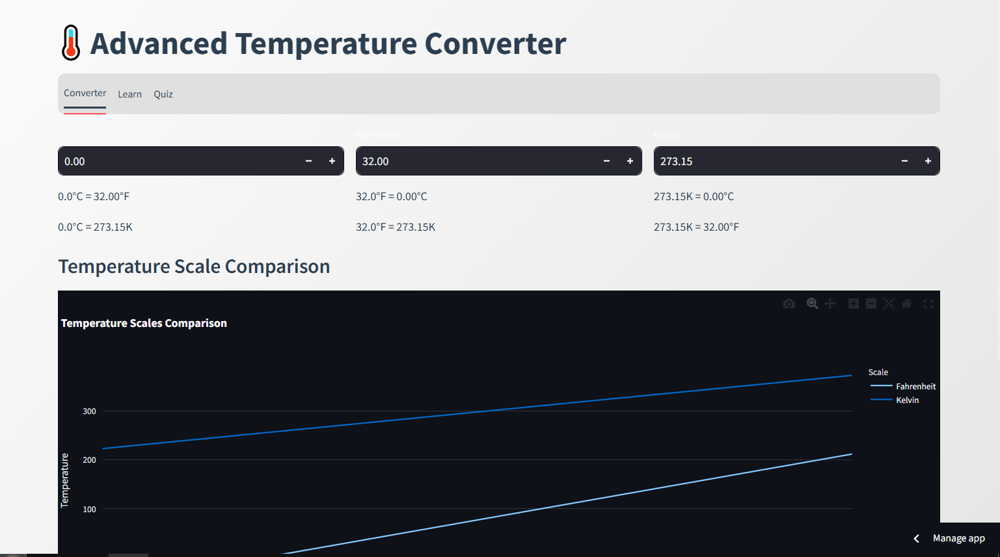

# Advanced Temperature Converter

## 🌡️ About This Project
This project is an **Advanced Temperature Converter** built using **Streamlit** and **Plotly**, allowing users to seamlessly convert temperatures between Celsius, Fahrenheit, and Kelvin. It also includes a learning section to understand temperature scales and a fun interactive quiz to test your knowledge.

## 🚀 Features
- **Temperature Converter**: Convert values between Celsius, Fahrenheit, and Kelvin instantly.
- **Temperature Scale Comparison**: A graph showing the relationship between temperature scales.
- **Learn Section**: Detailed explanations of Celsius, Fahrenheit, and Kelvin scales.
- **Interactive Quiz**: A multiple-choice quiz to test your knowledge of temperature conversions.
- **Light/Dark Mode**: Users can switch between light and dark themes for a better experience.

## 🛠️ Technologies Used
- **Python** 🐍
- **Streamlit** (Web App Framework)
- **Plotly** (Data Visualization)
- **Pandas** (Data Handling)
- **HTML & CSS** (For UI Styling)

## 📂 Project Structure
```
📂 growth_mindset_challenge/
├── app.py  # Main Streamlit app
├── requirements.txt  # Required dependencies
├── README.md  # Project documentation
└── assets/  # Additional assets (if any)
```

## 🔧 Installation & Setup
To run this project locally, follow these steps:

### 1️⃣ **Clone the Repository**
```bash
git clone <your-repository-url>
cd growth_mindset_challenge
```

### 2️⃣ **Install Dependencies**
```bash
pip install -r requirements.txt
```

### 3️⃣ **Run the Streamlit App**
```bash
streamlit run app.py
```

## 📊 Screenshots
 *(Add a relevant screenshot of the app)*

## 📝 How to Use
1. **Convert Temperatures**:
   - Enter a value in Celsius, Fahrenheit, or Kelvin to see instant conversions.
2. **Compare Temperature Scales**:
   - View a dynamic graph comparing different temperature scales.
3. **Learn About Temperature**:
   - Read about Celsius, Fahrenheit, and Kelvin scales with key facts.
4. **Take the Quiz**:
   - Test your knowledge with a fun interactive quiz.

## 🌍 Deployment
You can deploy the app on **Streamlit Cloud** by following these steps:
1. Push your code to **GitHub**.
2. Visit [Streamlit Cloud](https://share.streamlit.io/).
3. Connect your repository and deploy the app.

## 🎯 Future Enhancements
- Add **unit tests** for validation.
- Improve **quiz functionality** (timed quizzes, score tracking).
- Add **API integration** for real-time temperature data.

## 🤝 Contributing
Feel free to fork this repository and submit pull requests. Contributions are welcome!

## 📜 License
This project is licensed under the **MIT License**.

## ❤️ Acknowledgements
Built with love by **Hafiz Muhammad Umar Farooq** using **Streamlit**. 

✉️ **For any queries, reach out to me!**
